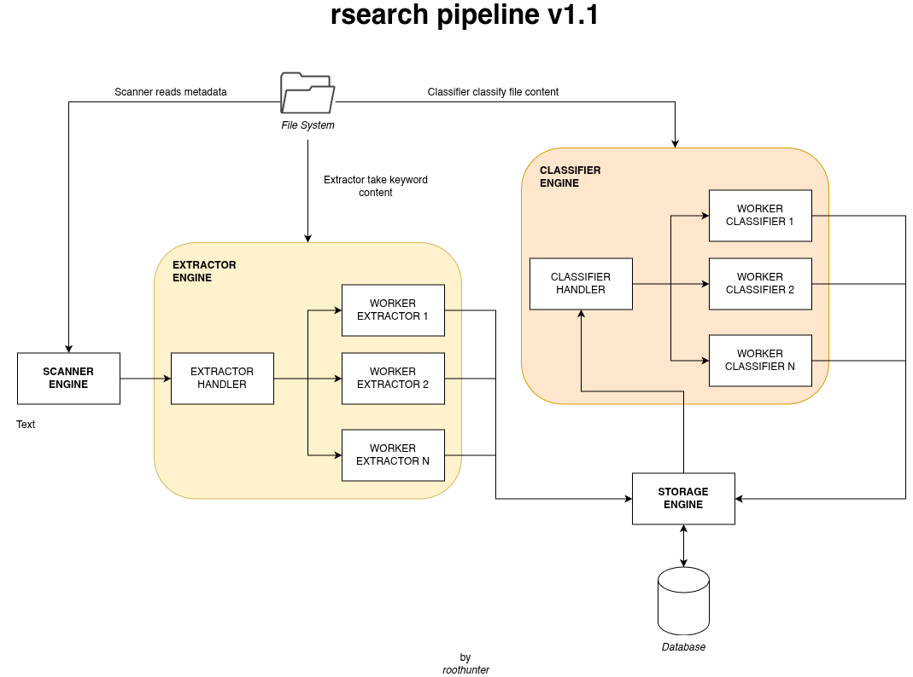

# rsearch

`rsearch` is a **high-performance document scanner and extractor** written in Rust.  
It indexes files from your system, extracts text (PDF, TXT, etc.), and stores them in a searchable database with full-text search capabilities.

---




## Features

- Scan folders and subfolders for documents
- Extract text from supported formats (PDF, TXT)
- High-performance bulk insertion into SQLite
- Full-text search with FTS5 indexing
- Multi-threaded processing with a producer-consumer pipeline
- Configurable logging with timestamps and file output
- Environment variable configuration for batch sizes, flush intervals, and log target

---

## Installation

### Prerequisites

- Rust >= 1.70
- SQLite
- **PDFium** (for PDF text extraction)

#### Install PDFium

Download a precompiled binary for Linux:

```bash
make install-pdfium
```
Or
```bash
mkdir -p vendor/pdfium
cd vendor/pdfium
wget https://github.com/bblanchon/pdfium-binaries/releases/latest/download/pdfium-linux-x64.tgz
tar -xzf pdfium-linux-x64.tgz
```


DEV NOTES

- 11.4 MB DB with zip and pdf search

## TODO LIST

- [ ] Create single thread StorageEngine to insert and query the data from and to the DB
- [ ] Implements Classification Engine Component
- [ ] Demonize the software
- [ ] Create API to call command on the demon
- [ ] Create a CLI interface that use the deamon APIs
- [ ] Archive searching (zip, xz, ...)
- [ ] remove all .unwrap()
- [x] implement stream base text extractor / tokenizator algo
- [ ] define lifecycle base component architecture (Scanner, Engines, etc)